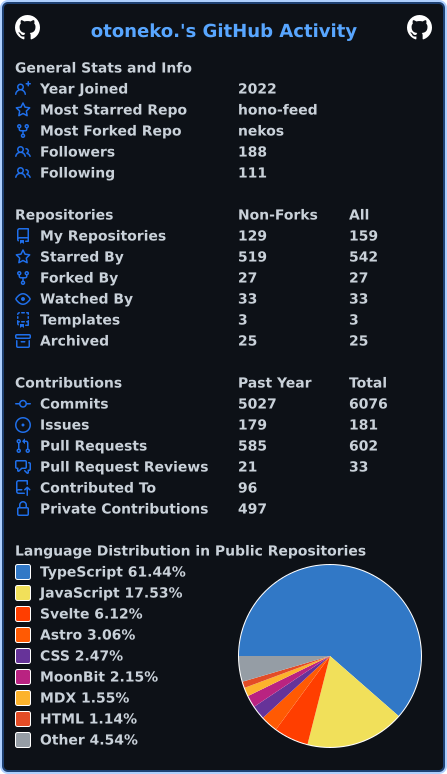
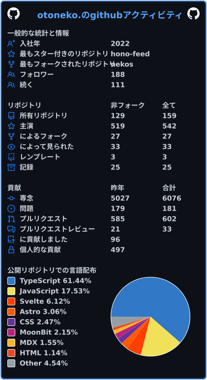
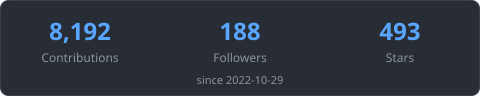

::kiritan{switcher}

 

I'm swimming in the ocean, forever and ever...

:::kiritan{locale=en}
Portfolio: https://otoneko.cat

Team: [@oto-home](https://github.com/oto-home) / Personal: [@oto-lab](https://github.com/oto-lab)
:::

:::kiritan{locale=ja}
ポートフォリオ: https://otoneko.cat

チーム: [@oto-home](https://github.com/oto-home) / 個人: [@oto-lab](https://github.com/oto-lab)
:::

:::kiritan{locale=en}
## Stats

## Recent activity
:::

:::kiritan{locale=ja}
## 統計

## 最近の活動
:::

<!-- activity:start -->
- 🟣 [fix: match Express 4 body-parser and query parser defaults under compat=4](https://github.com/otnc/exphono/pull/38) - otnc/exphono
- 🟣 [chore: update hono and other dev dependencies](https://github.com/otnc/exphono/pull/37) - otnc/exphono
- 🟣 [fix: use a port of path-to-regexp@0.1.x for compat=4 path syntax](https://github.com/otnc/exphono/pull/36) - otnc/exphono
- 🟣 [fix: close more compat=4 res/req parity gaps](https://github.com/otnc/exphono/pull/35) - otnc/exphono
- 🟣 [chore: bump express4 to ^4.22.3](https://github.com/otnc/exphono/pull/34) - otnc/exphono
<!-- activity:end -->

:::kiritan{locale=en}
## Community

Tech topics & chat. I'm a staff of Evex Developers (left), and Oto Home is my own (right).
:::

:::kiritan{locale=ja}
## コミュニティ

技術の話やおしゃべりの場です. 左は運営スタッフをしている Evex Developers, 右は自分で作った Oto Home です.
:::

 

:::kiritan{locale=en}
## Support
:::

:::kiritan{locale=ja}
## 支援
:::

 

:::kiritan{locale=en}
## Contact
:::

:::kiritan{locale=ja}
## 連絡先
:::

- [Twitter: @rin_pineapple](https://twitter.com/rin_pineapple)
- [Twitter: @rin_montblank](https://twitter.com/rin_montblank)

:::kiritan{locale=en}

More

:::

:::kiritan{locale=ja}

もっと見る

:::

<a href="https://commit-history.com/otnc">
  <picture>
    <source media="(prefers-color-scheme: dark)" srcset="https://commit-history.com/embed/otnc?theme=dark" />
    
  </picture>
</a>

