# Hi there 🐈

-BC002D?logo=googletranslate\&logoColor=white)
-012169?logo=googletranslate\&logoColor=white)

**I'm *otoneko.* a.k.a. *marron.***

***

**English** | [日本語](README.ja.md)

I'm swimming in the ocean, forever and ever...

Portfolio: https://otoneko.cat / https://montblank.fun

Team: [@oto-home](https://github.com/oto-home) / Personal: [@oto-lab](https://github.com/oto-lab)

## Stats

## UUID

<code>a710c2c5-272c-495d-8215-d8444a007f95</code>

Given by @mimifuwacc ([Twitter](https://twitter.com/mimifuwacc) / [GitHub](https://github.com/mimifuwacc))

***

Issuer:

- <https://twitter.com/mimifuwacc/status/2037864351907107222> (@mimifuwacc)
- <https://twitter.com/rin_montblank/status/2097596799540432933> (@rin\_montblank)

## Recent activity

<!-- activity:start -->

- 🟣 [fix: fail loudly and retry when downloading the express suite tarball](https://github.com/otnc/exphono/pull/39) - otnc/exphono
- 🟣 [fix: match Express 4 body-parser and query parser defaults under compat=4](https://github.com/otnc/exphono/pull/38) - otnc/exphono
- 🟣 [chore: update hono and other dev dependencies](https://github.com/otnc/exphono/pull/37) - otnc/exphono
- 🟣 [fix: use a port of path-to-regexp@0.1.x for compat=4 path syntax](https://github.com/otnc/exphono/pull/36) - otnc/exphono
- 🟣 [fix: close more compat=4 res/req parity gaps](https://github.com/otnc/exphono/pull/35) - otnc/exphono

<!-- activity:end -->

## Community

Tech topics & chat. I'm a staff of Evex Developers (left), and Oto Home is my own (right).

 

## Support me!

  

## Contact

- [Twitter: @rin\_pineapple](https://twitter.com/rin_pineapple)
- [Twitter: @rin\_montblank](https://twitter.com/rin_montblank)
- [Misskey: @o@misskey.otnc.dev](https://misskey.otnc.dev/@o)
- [Misskey: @m@misskey.otnc.dev](https://misskey.otnc.dev/@m)

More

<a href="https://commit-history.com/otnc">
  <picture>
    <source media="(prefers-color-scheme: dark)" srcset="https://commit-history.com/embed/otnc?theme=dark" />
    
  </picture>
</a>

